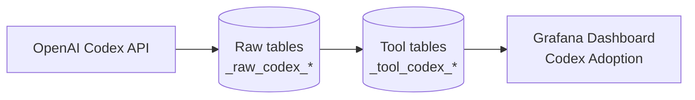

<!--
Licensed to the Apache Software Foundation (ASF) under one or more
contributor license agreements.  See the NOTICE file distributed with
this work for additional information regarding copyright ownership.
The ASF licenses this file to You under the Apache License, Version 2.0
(the "License"); you may not use this file except in compliance with
the License.  You may obtain a copy of the License at

    http://www.apache.org/licenses/LICENSE-2.0

Unless required by applicable law or agreed to in writing, software
distributed under the License is distributed on an "AS IS" BASIS,
WITHOUT WARRANTIES OR CONDITIONS OF ANY KIND, either express or implied.
See the License for the specific language governing permissions and
limitations under the License.
-->
# Codex Plugin (Adoption Metrics)

This plugin ingests OpenAI Codex **project-level adoption metrics** (daily usage, seat assignments, etc.) and enables dashboards for adoption trends.

It follows the same structure/patterns as other DevLake data-source plugins (notably `backend/plugins/gh-copilot`).

## What it collects

**Phase 1 endpoints** (Codex API):

- `GET /projects/{projectId}/usage`
- `GET /projects/{projectId}/seats`

**Stored data (tool layer)**:

- `_tool_codex_project_metrics` (daily aggregates)
- `_tool_codex_seats` (seat assignments)

## Data flow (high level)



## Repository layout

- `api/` – REST layer for connections/scopes
- `impl/` – plugin meta, options, connection helpers
- `models/` – tool-layer models + migrations
- `tasks/` – collectors/extractors and pipeline registration
- `e2e/` – E2E fixtures and golden CSV assertions
- `docs/` – documentation assets

## Setup

### Prerequisites

- OpenAI Codex enabled for the target project
- An API key with access to Codex usage/seat endpoints

### 1) Create a connection

1. DevLake UI → **Data Integrations → Add Connection → Codex**
2. Fill in:
   - **Name**: e.g. `Codex Project Alpha`
   - **Project ID**: Codex project identifier
   - **API Key**: with required access
3. Click **Test Connection** (calls `GET /projects/{projectId}/usage`).
4. Save the connection.

### 2) Create a scope

Add a project scope for that connection. For Phase 1, additional scope config is not required.

### 3) Create a blueprint (recipe)

Use a blueprint plan like:

```json
[
  [
    {
      "plugin": "codex",
      "options": {
        "connectionId": 1,
        "scopeId": "project-alpha"
      }
    }
  ]
]
```

Run the blueprint daily to keep metrics up to date.

## Dashboard

The Grafana dashboard JSON should be placed in `grafana/dashboards/codex/adoption.json`.

## Error handling guidance

- **403 Forbidden** → API key missing required scope, or project lacks Codex access
- **404 Not Found** → incorrect project ID, or Codex endpoints unavailable for the project
- **429 Too Many Requests** → respect `Retry-After`; collectors should implement backoff/retry

Tokens are sanitized before persisting. When patching an existing connection, omit the API key to retain the encrypted value already stored in DevLake.

## Limitations (Phase 1)

- Metrics endpoint may be limited to a rolling window (API constraint)
- OpenAI may enforce privacy thresholds and omit daily data
- Per-user metrics or advanced exports may be deferred to future phases

## More docs

- See `docs/` for additional documentation assets if needed.
