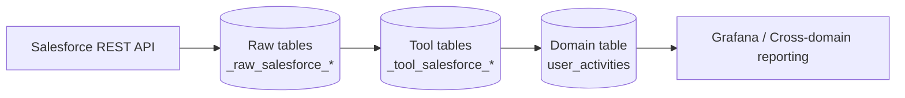

<!--
Licensed to the Apache Software Foundation (ASF) under one or more
contributor license agreements.  See the NOTICE file distributed with
this work for additional information regarding copyright ownership.
The ASF licenses this file to You under the Apache License, Version 2.0
(the "License"); you may not use this file except in compliance with
the License.  You may obtain a copy of the License at

    http://www.apache.org/licenses/LICENSE-2.0

Unless required by applicable law or agreed to in writing, software
distributed under the License is distributed on an "AS IS" BASIS,
WITHOUT WARRANTIES OR CONDITIONS OF ANY KIND, either express or implied.
See the License for the specific language governing permissions and
limitations under the License.
-->
# Salesforce Plugin (User Activity)

This plugin ingests Salesforce **organization-level user activity** and converts it into cross-domain `UserActivity` records for daily reporting.

It follows the same structure/patterns as other DevLake data-source plugins, especially the activity-style plugins such as `backend/plugins/notion` and `backend/plugins/hubspot`.

## What it collects

The plugin uses the Salesforce REST API SOQL query endpoint:

```text
GET /services/data/{version}/query
```

REST requests are sent with the SOQL query in the `q` query parameter:

```text
GET /services/data/{version}/query?q=<SOQL>
```

It currently runs three types of SOQL queries:

**1. Organization discovery**

Used to validate the connection and create the Salesforce org scope.

```text
GET /services/data/{version}/query?q=SELECT Id, Name FROM Organization LIMIT 1
```

```sql
SELECT Id, Name
FROM Organization
LIMIT 1
```

**2. Active user enrichment**

Used to resolve Salesforce actor IDs into names and emails for reporting.

```text
GET /services/data/{version}/query?q=SELECT Id, Name, Username, Email, IsActive FROM User WHERE IsActive = true ORDER BY Id ASC
```

```sql
SELECT Id, Name, Username, Email, IsActive
FROM User
WHERE IsActive = true
ORDER BY Id ASC
```

**3. Activity polling**

Used to detect create/update-style activity from selected Salesforce objects.

```text
GET /services/data/{version}/query?q=SELECT Id, CreatedDate, CreatedById, LastModifiedDate, LastModifiedById, SystemModstamp FROM <Object> WHERE SystemModstamp >= 2026-04-01T00:00:00Z ORDER BY SystemModstamp ASC, Id ASC
```

```sql
SELECT Id, CreatedDate, CreatedById, LastModifiedDate, LastModifiedById, SystemModstamp
FROM <Object>
WHERE SystemModstamp >= 2026-04-01T00:00:00Z
ORDER BY SystemModstamp ASC, Id ASC
```

This plugin does not replicate full Salesforce CRM records. It collects only the fields needed to answer: **which user created or updated which Salesforce object, and when?**

**Supported CRM objects**:

- `Account`
- `Contact`
- `Lead`
- `Opportunity`
- `Case`
- `Task`
- `Event`

**Stored data (tool layer)**:

- `_tool_salesforce_scopes` (Salesforce org scope)
- `_tool_salesforce_scope_configs` (selected object types / CDC flag)
- `_tool_salesforce_users` (user enrichment records)
- `_tool_salesforce_activity_events` (normalized create/update activity rows)
- `_tool_salesforce_cdc_checkpoints` (created for CDC checkpoint storage; CDC collection is not implemented yet)

**Raw data**:

- `_raw_salesforce_account`
- `_raw_salesforce_contact`
- `_raw_salesforce_lead`
- `_raw_salesforce_opportunity`
- `_raw_salesforce_case`
- `_raw_salesforce_task`
- `_raw_salesforce_event`

Salesforce `User` records are currently stored directly in `_tool_salesforce_users` for actor enrichment; they are not written to a separate `_raw_salesforce_user` table.

**Domain output**:

- `crossdomain.UserActivity`
- physical database table: `lake.user_activities`
- Salesforce rows are marked with `source_system = 'salesforce'`

## Data flow (high level)



## Repository layout

- `api/` – REST layer for connections, scopes, and scope-configs
- `impl/` – plugin meta and API/resource registration
- `models/` – tool-layer models + migrations
- `tasks/` – collectors, extractors, converters, and pipeline registration

## Setup

### Prerequisites

- A Salesforce org or sandbox with API access
- One of the supported authentication modes:
  - **Access Token**: `accessToken` + `instanceUrl`
  - **Refresh Token**: `refreshToken` + `clientId` + `clientSecret` + optional `loginUrl`
- For refresh-token mode, a Salesforce OAuth app:
  - **External Client App** for new setups, or
  - **Connected App** if your org already uses one
- Permission to query:
  - `Organization`
  - `User`
  - the selected Salesforce objects listed above

### 1) Get Salesforce OAuth tokens

If you already have an `access_token` or `refresh_token`, skip this section and create the DevLake connection directly.

For a new Salesforce org, create an **External Client App** or **Connected App** first, then use the OAuth Web Server flow to get tokens.

1. In Salesforce Setup, create an OAuth app.
2. Enable OAuth settings.
3. Add this callback URL:

```text
http://localhost:1717/callback
```

4. Enable scopes needed by the plugin:
   - `api`
   - `refresh_token` / `offline_access`
5. Copy the Salesforce **Consumer Key** and **Consumer Secret**.
   - Consumer Key is used as `client_id`.
   - Consumer Secret is used as `client_secret`.
6. Open this authorize URL in a browser:

```text
https://login.salesforce.com/services/oauth2/authorize?response_type=code&client_id=CLIENT_ID&redirect_uri=http%3A%2F%2Flocalhost%3A1717%2Fcallback&scope=api%20refresh_token
```

For sandbox orgs, use:

```text
https://test.salesforce.com/services/oauth2/authorize?response_type=code&client_id=CLIENT_ID&redirect_uri=http%3A%2F%2Flocalhost%3A1717%2Fcallback&scope=api%20refresh_token
```

For My Domain / Developer Edition login, you can also use your org domain:

```text
https://your-domain.my.salesforce.com/services/oauth2/authorize?response_type=code&client_id=CLIENT_ID&redirect_uri=http%3A%2F%2Flocalhost%3A1717%2Fcallback&scope=api%20refresh_token
```

7. Log in and approve access.
8. Salesforce redirects to the callback URL. Copy the `code` query parameter from the browser URL:

```text
http://localhost:1717/callback?code=AUTHORIZATION_CODE
```

9. Exchange the authorization code for tokens:

```bash
curl -s https://login.salesforce.com/services/oauth2/token \
  -H "Content-Type: application/x-www-form-urlencoded" \
  -d "grant_type=authorization_code" \
  --data-urlencode "code=AUTHORIZATION_CODE" \
  -d "client_id=CLIENT_ID" \
  -d "client_secret=CLIENT_SECRET" \
  --data-urlencode "redirect_uri=http://localhost:1717/callback"
```

For sandbox orgs, exchange against:

```bash
curl -s https://test.salesforce.com/services/oauth2/token \
  -H "Content-Type: application/x-www-form-urlencoded" \
  -d "grant_type=authorization_code" \
  --data-urlencode "code=AUTHORIZATION_CODE" \
  -d "client_id=CLIENT_ID" \
  -d "client_secret=CLIENT_SECRET" \
  --data-urlencode "redirect_uri=http://localhost:1717/callback"
```

The response includes the values needed by DevLake:

```json
{
  "access_token": "00D...",
  "refresh_token": "5Aep...",
  "instance_url": "https://your-instance.my.salesforce.com"
}
```

Use `instance_url` as the DevLake **Instance URL**. For long-running syncs, prefer **Refresh Token** auth mode so DevLake can refresh expired access tokens automatically.

### 2) Create a connection

1. DevLake UI → **Data Integrations → Add Connection → Salesforce**
2. Fill in:
   - **Name**: e.g. `Salesforce Sandbox`
   - **Authentication Mode**:
     - `Access Token`, or
     - `Refresh Token`
   - For **Access Token** mode:
     - **Instance URL**: e.g. `https://your-instance.my.salesforce.com`
     - **Access Token**
   - For **Refresh Token** mode:
     - **Login URL**: `https://login.salesforce.com` or `https://test.salesforce.com`
     - **Client ID**
     - **Client Secret**
     - **Refresh Token**
   - **API Version**: defaults to `v61.0`
   - **Rate Limit Per Hour**: optional; defaults to `5000`
3. Click **Test Connection**.
   - The plugin validates the credentials by querying the Salesforce `Organization` object.
4. Save the connection.

### 3) Create a scope

The plugin treats the Salesforce org as the scope.

1. Load remote scopes for the connection.
2. Select the returned Salesforce organization.
3. Save it as the plugin scope.

### 4) Create a scope config

Pick which objects should be polled and transformed into user activity.

- Default object types:
  - `Account`
  - `Contact`
  - `Lead`
  - `Opportunity`
  - `Case`
  - `Task`
  - `Event`
- Keep `useCdc` set to `false` for now.

### 5) Create a blueprint (recipe)

Use a blueprint plan like:

```json
[
  [
    {
      "plugin": "salesforce",
      "options": {
        "connectionId": 1,
        "scopeId": "00Dxxxxxxxxxxxx",
        "objectTypes": ["Lead", "Opportunity", "Case"],
        "useCdc": false
      }
    }
  ]
]
```

Optional time filters:

- `occurredAfter`
- `occurredBefore`

If not provided, the first run defaults to the last 30 days. Later runs continue incrementally from the previous successful collection time.

## DevLake plugin APIs

The Salesforce plugin exposes standard DevLake plugin endpoints under `/plugins/salesforce/...`.

These APIs are used to:

- test Salesforce credentials
- create/update/delete connections
- discover the Salesforce org scope
- save scope configs
- attach scopes to a connection

### Connection APIs

- `POST /plugins/salesforce/test`
  - Test a new connection before saving it
- `POST /plugins/salesforce/connections`
  - Create a Salesforce connection
- `GET /plugins/salesforce/connections`
  - List saved Salesforce connections
- `GET /plugins/salesforce/connections/{connectionId}`
  - Fetch one connection
- `PATCH /plugins/salesforce/connections/{connectionId}`
  - Update an existing connection
- `DELETE /plugins/salesforce/connections/{connectionId}`
  - Delete a connection
- `POST /plugins/salesforce/connections/{connectionId}/test`
  - Re-test an existing saved connection

**Example: test a new access-token connection**

```bash
curl -X POST http://localhost:8080/plugins/salesforce/test \
  -H 'Content-Type: application/json' \
  -d '{
    "name": "sf-sandbox",
    "authMode": "access_token",
    "instanceUrl": "https://your-instance.my.salesforce.com",
    "accessToken": "YOUR_ACCESS_TOKEN",
    "apiVersion": "v61.0"
  }'
```

**Example: create a refresh-token connection**

```bash
curl -X POST http://localhost:8080/plugins/salesforce/connections \
  -H 'Content-Type: application/json' \
  -d '{
    "name": "sf-prod",
    "authMode": "refresh_token",
    "loginUrl": "https://login.salesforce.com",
    "clientId": "YOUR_CLIENT_ID",
    "clientSecret": "YOUR_CLIENT_SECRET",
    "refreshToken": "YOUR_REFRESH_TOKEN",
    "apiVersion": "v61.0"
  }'
```

### Scope discovery APIs

- `GET /plugins/salesforce/connections/{connectionId}/remote-scopes`
  - Discover available remote scopes
- `GET /plugins/salesforce/connections/{connectionId}/search-remote-scopes?search=...`
  - Search the discovered scope

For Salesforce, this plugin currently returns **one org-level scope** by querying the Salesforce `Organization` object.

**Example: list remote scopes**

```bash
curl http://localhost:8080/plugins/salesforce/connections/1/remote-scopes
```

Typical response shape:

```json
{
  "children": [
    {
      "id": "00Dxxxxxxxxxxxx",
      "name": "Your Salesforce Org",
      "fullName": "Your Salesforce Org",
      "type": "scope"
    }
  ]
}
```

### Scope APIs

- `GET /plugins/salesforce/connections/{connectionId}/scopes`
  - List scopes saved for the connection
- `PUT /plugins/salesforce/connections/{connectionId}/scopes`
  - Save one or more scopes
- `GET /plugins/salesforce/connections/{connectionId}/scopes/{scopeId}`
  - Get a scope
- `PATCH /plugins/salesforce/connections/{connectionId}/scopes/{scopeId}`
  - Update a scope
- `DELETE /plugins/salesforce/connections/{connectionId}/scopes/{scopeId}`
  - Delete a scope
- `GET /plugins/salesforce/connections/{connectionId}/scopes/{scopeId}/latest-sync-state`
  - Check latest sync metadata for the scope

**Example: save the org scope**

```bash
curl -X PUT http://localhost:8080/plugins/salesforce/connections/1/scopes \
  -H 'Content-Type: application/json' \
  -d '{
    "data": [
      {
        "id": "00Dxxxxxxxxxxxx",
        "name": "Your Salesforce Org",
        "scopeConfigId": 1
      }
    ]
  }'
```

### Scope-config APIs

- `POST /plugins/salesforce/connections/{connectionId}/scope-configs`
  - Create a scope config
- `GET /plugins/salesforce/connections/{connectionId}/scope-configs`
  - List scope configs
- `GET /plugins/salesforce/connections/{connectionId}/scope-configs/{scopeConfigId}`
  - Get one scope config
- `PATCH /plugins/salesforce/connections/{connectionId}/scope-configs/{scopeConfigId}`
  - Update a scope config
- `DELETE /plugins/salesforce/connections/{connectionId}/scope-configs/{scopeConfigId}`
  - Delete a scope config
- `GET /plugins/salesforce/scope-config/{scopeConfigId}/projects`
  - Standard DevLake helper endpoint for scope-config project mapping

**Example: create a scope config**

```bash
curl -X POST http://localhost:8080/plugins/salesforce/connections/1/scope-configs \
  -H 'Content-Type: application/json' \
  -d '{
    "name": "sf-activity",
    "objectTypes": ["Lead", "Opportunity", "Case"],
    "useCdc": false
  }'
```

### Pipeline API example

Once the connection, scope config, and scope exist, DevLake can run the Salesforce plugin through the normal pipeline API.

**Example: run a pipeline**

```bash
curl -X POST http://localhost:8080/pipelines \
  -H 'Content-Type: application/json' \
  -d '{
    "name": "salesforce-activity",
    "plan": [[
      {
        "plugin": "salesforce",
        "subtasks": [
          "collectUsers",
          "collectActivityPolling",
          "extractActivity",
          "convertActivity"
        ],
        "options": {
          "connectionId": 1,
          "scopeId": "00Dxxxxxxxxxxxx",
          "objectTypes": ["Lead", "Opportunity", "Case"],
          "useCdc": false
        }
      }
    ]]
  }'
```

## Salesforce APIs used internally

The plugin itself talks to Salesforce through the REST API and SOQL query endpoints.

### 1) Connection test / remote scope discovery

The plugin verifies access and discovers the org scope by running:

```text
GET /services/data/{version}/query?q=SELECT Id, Name FROM Organization LIMIT 1
```

This is why the plugin currently exposes one org-level scope.

### 2) Refresh-token authentication

When `authMode=refresh_token`, the plugin refreshes the access token with:

```text
POST {loginUrl}/services/oauth2/token
```

Form payload:

- `grant_type=refresh_token`
- `client_id=...`
- `client_secret=...`
- `refresh_token=...`

### 3) User enrichment

To resolve user names and emails, the plugin queries:

```sql
SELECT Id, Name, Username, Email, IsActive
FROM User
WHERE IsActive = true
ORDER BY Id ASC
```

### 4) Activity polling

For each selected object type, the plugin polls Salesforce with SOQL shaped like:

```sql
SELECT Id, CreatedDate, CreatedById, LastModifiedDate, LastModifiedById, SystemModstamp
FROM Lead
WHERE SystemModstamp >= 2026-04-01T00:00:00Z
ORDER BY SystemModstamp ASC, Id ASC
```

The same pattern is used for:

- `Account`
- `Contact`
- `Lead`
- `Opportunity`
- `Case`
- `Task`
- `Event`

The plugin then maps those results into `_tool_salesforce_activity_events` and finally into `crossdomain.UserActivity`, whose physical database table is `lake.user_activities`.

## Dashboard

Salesforce activity data can be visualized in Grafana.
Use Grafana with the **MySQL** datasource and query table:

```sql
lake.user_activities
```

If Grafana already uses `lake` as default DB, you can use just:

```sql
user_activities
```

**1. Salesforce Total Activities**

Panel type: `Stat`

```sql
SELECT
  COUNT(*) AS value
FROM lake.user_activities
WHERE source_system = 'salesforce'
  AND $__timeFilter(action_time);
```

**2. Per-User Activity Counts**

Panel type: `Bar chart` or `Table`

```sql
SELECT
  COALESCE(NULLIF(user_display, ''), NULLIF(user_email, ''), native_user_id, 'Unknown') AS user,
  COUNT(*) AS activity_count
FROM lake.user_activities
WHERE source_system = 'salesforce'
  AND $__timeFilter(action_time)
GROUP BY user
ORDER BY activity_count DESC;
```

**3. Daily Salesforce Activities**

Panel type: `Time series`

```sql
SELECT
  $__timeGroupAlias(action_time, '1d'),
  COUNT(*) AS value
FROM lake.user_activities
WHERE source_system = 'salesforce'
  AND $__timeFilter(action_time)
GROUP BY 1
ORDER BY 1;
```

**4. Daily Activities Per User**

Panel type: `Time series`

```sql
SELECT
  $__timeGroupAlias(action_time, '1d'),
  COALESCE(NULLIF(user_display, ''), NULLIF(user_email, ''), native_user_id, 'Unknown') AS metric,
  COUNT(*) AS value
FROM lake.user_activities
WHERE source_system = 'salesforce'
  AND $__timeFilter(action_time)
GROUP BY 1, metric
ORDER BY 1;
```

**5. Activity Count By Action Type**

Panel type: `Pie chart` or `Bar chart`

```sql
SELECT
  action_type AS action_type,
  COUNT(*) AS activity_count
FROM lake.user_activities
WHERE source_system = 'salesforce'
  AND $__timeFilter(action_time)
GROUP BY action_type
ORDER BY activity_count DESC;
```

**6. Activity Count By Salesforce Object**

Panel type: `Bar chart`

```sql
SELECT
  object_type,
  COUNT(*) AS activity_count
FROM lake.user_activities
WHERE source_system = 'salesforce'
  AND $__timeFilter(action_time)
GROUP BY object_type
ORDER BY activity_count DESC;
```

**7. Latest Salesforce Activities**

Panel type: `Table`

```sql
SELECT
  action_time,
  COALESCE(NULLIF(user_display, ''), NULLIF(user_email, ''), native_user_id, 'Unknown') AS user,
  action_type,
  object_type,
  object_ref,
  summary
FROM lake.user_activities
WHERE source_system = 'salesforce'
ORDER BY action_time DESC
LIMIT 100;
```

**8. Compare Salesforce, HubSpot, Notion**

Panel type: `Bar chart`

```sql
SELECT
  source_system,
  COUNT(*) AS activity_count
FROM lake.user_activities
WHERE $__timeFilter(action_time)
GROUP BY source_system
ORDER BY activity_count DESC;
```

## Error handling guidance

- **401 Unauthorized** → invalid access token, expired access token, or refresh token flow failed
- **403 Forbidden** → Salesforce user/app lacks permission to query the required objects
- **404 Not Found** → wrong `instanceUrl`, unsupported API version, or invalid route
- **400 Bad Request** → malformed SOQL, unavailable object, or bad OAuth/token refresh parameters

Tokens and secrets are sanitized before responses are returned from DevLake. When patching an existing connection, omit the secret fields to keep the encrypted values already stored in DevLake.

## Limitations

- The plugin is **activity-focused**, not a full Salesforce CRM replication plugin
- Polling collects create/update-style activity from the supported objects listed above
- CDC configuration and checkpoint storage are present, but CDC collection is **not implemented yet**; keep `useCdc=false`
- Actor email/display enrichment depends on the Salesforce `User` query succeeding
- No bundled Salesforce Grafana dashboard JSON is committed yet, but Salesforce data can still be visualized manually from `lake.user_activities`

## Official Salesforce documentation

- [Accessing Object Data with Salesforce Platform APIs](https://developer.salesforce.com/blogs/2024/04/accessing-object-data-with-salesforce-platform-apis)
  - Useful overview of Salesforce Platform APIs, REST API structure, and the query resource
- [Create an External Client App](https://help.salesforce.com/s/articleView?id=xcloud.create_a_local_external_client_app.htm&language=en_US&type=5)
  - Official setup guide for creating a new external client app
- [OAuth Authorization Flows](https://help.salesforce.com/s/articleView?id=xcloud.remoteaccess_oauth_flows_ca.htm&language=en_US&type=5)
  - Official reference for supported Salesforce OAuth flows
- [OAuth 2.0 Refresh Token Flow for Renewed Sessions](https://help.salesforce.com/s/articleView?id=xcloud.remoteaccess_oauth_refresh_token_flow_ca.htm&language=en_US&type=5)
  - Matches the refresh-token mode used by this plugin
- [OAuth 2.0 Web Server Flow](https://developer.salesforce.com/docs/platform/mobile-sdk/guide/oauth-web-server-flow.html)
  - Useful when obtaining the initial authorization code and refresh token

## More docs

- See the plugin source under `backend/plugins/salesforce/`
- Implementation details live primarily in:
  - `tasks/collect_activity_polling.go`
  - `tasks/extract_activity.go`
  - `tasks/convert_activity.go`
